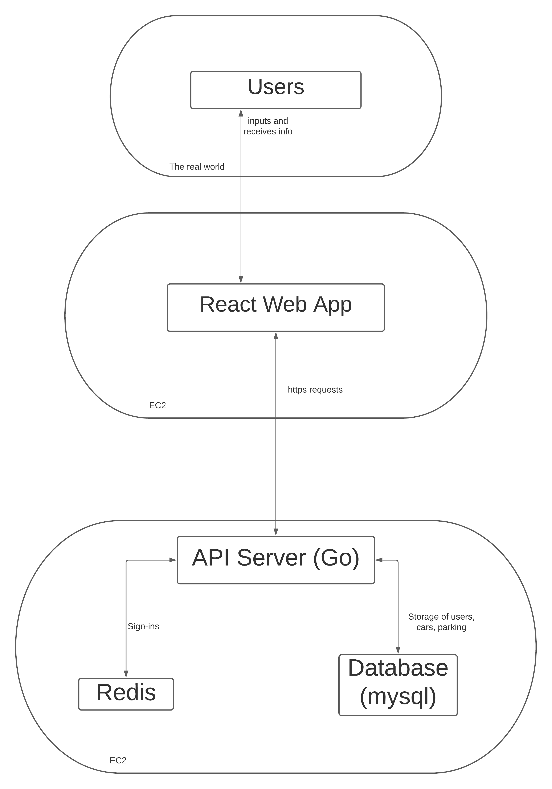

# smarking

## Project Description

Many of us have likely had at least one frustrating experience with parking, whether that be forgetting where we’ve parked or losing track of time after parking in a lot with hourly rates resulting in high fees. This is a struggle that is prevalent in many crowded cities such as Seattle that attract tourists from around the world. To help alleviate the stress people may feel around parking we will be building Smarking, a mobile website that helps users store information about their vehicles and set reminders or notifications for any time-sensitive parking areas. Specific features we plan to implement include storing pictures of the cars’ current location, starting “sessions'' where a user also starts an interval counter for areas with time-based fees, as well as notifications and reminders for this information. Overall, our goal is to create a simple and intuitive tool for drivers that will minimize the possible stress and issues they may encounter with parking, especially when in unfamiliar areas. This is an issue that we the developers have all personally encountered, both at the UW and when traveling.

## Technical Description

### Architectural diagram:

### Summary table:

| Priority  | User      | Description                                                                                           | Technical Implementation Strategy                                                                                                                                                                                                                                                                                                                                                                                                                                                                |
|-----------|-----------|-------------------------------------------------------------------------------------------------------|--------------------------------------------------------------------------------------------------------------------------------------------------------------------------------------------------------------------------------------------------------------------------------------------------------------------------------------------------------------------------------------------------------------------------------------------------------------------------------------------------|
| P0        | As a user | I want to take pictures of where I parked my car to clearly remind me of where I parked it            | Store the latest photos taken by the user in the current session using the Imgur API allowing us to store the image url hashes into a **MYSQL database** and display them clearly using **Javascript/React** as well as supporting **CSS** and **HTML**. We will be using media queries in our CSS to optimize the sizes of the images for various screen resolutions.                                                                                                                                           |
| P1        | As a user | I want to see when my parking ticket expires and go when I need to                                    | Utilize the **Go time module** to begin sessions and compare the session start times to the current time. Display a time value returned by comparing these to inform the user of how much time is left in their hour/time slot using **Javascript/React** as well as supporting **CSS** and **HTML**. Users will receive a notification when their parking is 10 minutes from expiring (probably either through an SMS client like **Twilio** or if we can get mobile notifications in some way through the browser) |
| P2        | As a user | I want to take notes on where I exactly parked my car                                                 | Stores the additional notes written by the user in the current session in the **MYSQL database**. Displays the information using **Javascript/React** as well as supporting **CSS** and **HTML**.                                                                                                                                                                                                                                                                                                                |
| P3        | As a user | I want to remember what does my car look like, especially it’s license plate so I can pay for parking | Stores/updates the car information for each user in the **MYSQL database**. Displays the information using **javascript/React** as well as supporting **CSS** and **HTML**.                                                                                                                                                                                                                                                                                                                                      |

### List of available endpoints:

**Sign-ins and Users**      // we’ve already done all of these

POST /users (Creates a new user)
GET /users/{id} (Returns the given user)
PATCH /users/{id} (Edits the given user)
POST /sessions (Starts a new session)
DELETE /sessions/mine (Ends the current session)

**Cars**

POST /users/{id}/cars (Adds a car to the user’s account)
GET /users/{id}/cars (Returns all of the given user’s cars)
GET /users/{id}/cars/{carid} (Returns the given user’s car)
PATCH /users/{id}/cars/{carid} (Edits the given user’s car)
DELETE /users/{id}/cars/{carid} (Remove the given user’s car)

**Parking**

POST /users/{id}/parking (Starts a parking request)
GET /users/{id}/parking/{parkid} (Checks on the parking request)
PATCH /users/{id}/parking/{parkid} (Edit the notes or expiry time)
DELETE /users/{id}/parking/{parkid} (Changes the status from open to closed)

### Database Schemas

**Redis store of sessions**

**Table Users**

    ID int not null auto_increment primary key,
    Email varchar(255) not null UNIQUE,
    PassHash varbinary(1024) not null,
    UserName varchar(255) not null UNIQUE,
    FirstName varchar(128) not null,
    LastName varchar(128) not null,
    phoneNumber varchar(10) not null,
    PhotoURL varchar(128) not null

**Table Cars**

    ID int not null auto_increment primary key,
    LicensePlate varchar(15) not null UNIQUE,
    UserID int not null foreign key,
    Make varchar(128),
    Model varchar(128),
    Year varchar(128),
    Color varchar(128)

**Table Parking**

    ID int not null auto_increment primary key,
    CarID int not null foreign key,
    UserID int not null foreign key,
    PhotoURL varchar(128),
    StartTime not null datetime,
    ExpireTime datetime,
    ReturnTime datetime,
    Notes Varchar(1028)
