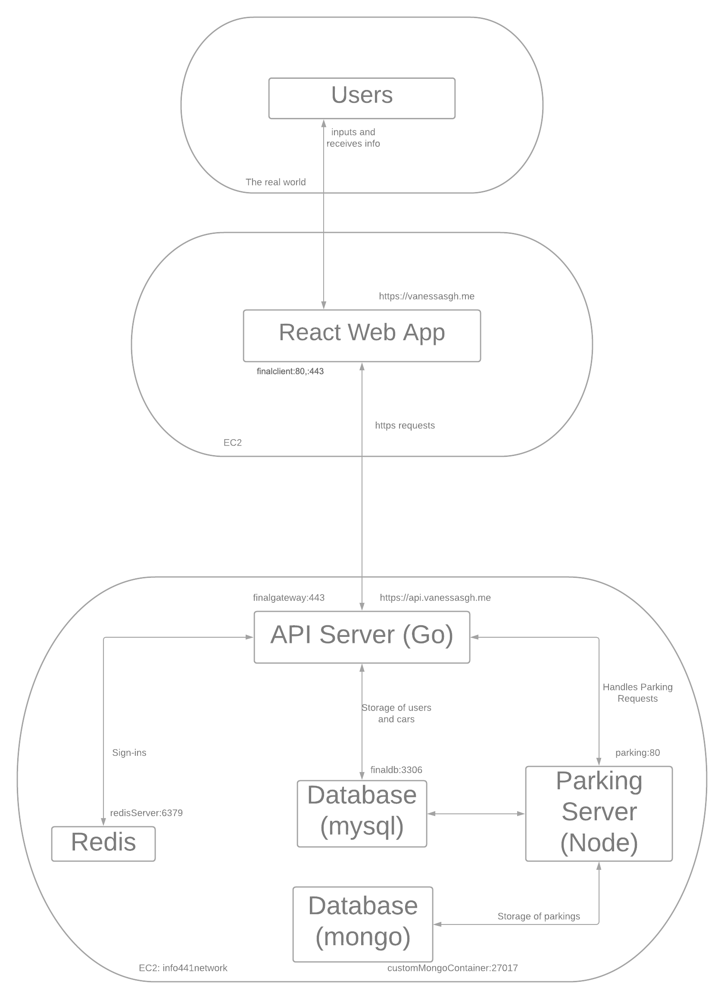

### Revised diagram:

# Smarking
[Link to google doc of original proposal](https://docs.google.com/document/d/1U3aJ9TUyNRi9zDy_ZbaEormrxUn0Ph9EPxJGNONXFck/edit#)
## Project Description

Many of us have likely had at least one frustrating experience with parking, whether that be forgetting where we’ve parked or losing track of time after parking in a lot with hourly rates resulting in high fees. This is a struggle that is prevalent in many crowded cities such as Seattle that attract tourists from around the world. To help alleviate the stress people may feel around parking we will be building Smarking, a mobile website that helps users store information about their vehicles and set reminders or notifications for any time-sensitive parking areas. Specific features implemented include storing specific car information, starting “sessions" where a user also starts an interval counter for areas with time-based fees, as well as notifications and reminders for this information. Overall, our goal is to create a simple and intuitive tool for drivers that will minimize the possible stress and issues they may encounter with parking. This is an issue that we the developers have all personally encountered, both at the UW and when traveling.

## Technical Description

### Architectural diagram:

### Summary table:

| Priority  | User      | Description                                                                                           | Technical Implementation Strategy                                                                                                                                                                                                                                                                                                                                                                                                                                                                |
|-----------|-----------|-------------------------------------------------------------------------------------------------------|--------------------------------------------------------------------------------------------------------------------------------------------------------------------------------------------------------------------------------------------------------------------------------------------------------------------------------------------------------------------------------------------------------------------------------------------------------------------------------------------------|
| P0        | As a user | I want to see when my parking ticket expires and go when I need to                                    | Utilize the **Javascript setInterval() method** to begin sessions and compare the session start times to the current time. Display a time value returned by comparing these to inform the user of how much time is left in their hour/time slot using **Javascript/React** as well as supporting **CSS** and **HTML**. Users will receive a notification when their parking is 5 minutes from expiring through the SMS library **Twilio** |
| P1        | As a user | I want to take notes on where I exactly parked my car                                                 | Stores the additional notes written by the user in the current parking session in the **Mongo database**. Displays the information using **Javascript/React** as well as supporting **CSS** and **HTML**.                                                                                                                                                                                                                                                                                                                |
| P2        | As a user | I want to remember the details about my car, especially it’s license plate so I can pay for parking | Stores/updates the car information for each user in the **MYSQL database**. Displays the information using **javascript/React** as well as supporting **CSS** and **HTML**.                                                                                                                                                                                                                                                                                                                                      |

### List of available endpoints and possible response codes:

**Sign-ins and Users**

POST /v1/users (Creates a new user)  
* 201, 400, 415  
GET /v1/users/{id} (Returns the given user) 
* 200, 401, 404, 406, 500  
PATCH /v1/users/{id} (Edits the given user) 
* 200, 400, 401, 403, 405, 415, 500  
POST /v1/sessions (Starts a new session)  
* 201, 400, 401, 415, 500  
DELETE /v1/sessions/mine (Ends the current session)  
* 403, 500  

**Cars**

POST /v1/cars (Adds a car to the user’s account)  
* 201, 400, 401, 415, 500  
GET /v1/cars (Returns all of the given user’s cars)  
* 200, 500  
GET /v1/cars/{carid} (Returns the given user’s car)  
* 200, 400, 401, 500  
PATCH /v1/cars/{carid} (Edits the given user’s car)  
* 200, 400, 401, 415, 500  
DELETE /v1/cars/{carid} (Remove the given user’s car)  
* 400, 401  

**Parking**

POST /v1/usersparking (Starts a parking request) 
* 401, 201, 400, 415, 500  
GET /v1/usersparking (Returns all user ongoing parking requests)  
* 401, 500  
GET /v1/parking/{parkid} (Returns on the specific parking request)  
* 401, 500  
PATCH /v1/parking/{parkid} (End the specific parking session)  
* 200, 400, 401, 403, 404, 415, 500  
DELETE /v1/parking/{parkid} (Completely remove the specific parking session)  
* 401, 403, 404, 405  

### Database Schemas

**Redis store of sessions**

**Table users**

    id int not null auto_increment primary key,
    email varchar(254) not null UNIQUE,
    passhash varchar(60) not null,
    username varchar(255) not null UNIQUE,
    first_name varchar(64) not null,
    last_name varchar(128) not null,
    phonenumber varchar(20) not null,
    photourl varchar(128) not null

**Table usersignin**

    id int not null REFERENCES users(id),
    whensignin time not null,
    clientip varchar(255) not null

**Table cars**

    ID int not null auto_increment primary key,
    LicensePlate varchar(15) not null,
    UserID int not null REFERENCES users(id),
    Make varchar(128),
    Model varchar(128),
    Year varchar(128),
    Color varchar(128)

**Schema parkingSchema**

    _id,
    carID { type: Number, required: true, unique: false },
    owner: { _id: { type: Number }, email: { type: String } },
    photoURL: { type: String, required: false, unique: false },
    startTime: { type: Date, required: true, unique: false },
    endTime: { type: Date, required: true, unique: false },
    isComplete: { type: Boolean, required: true, unique: false },
    notes: { type: String, required: false, unique: false }
